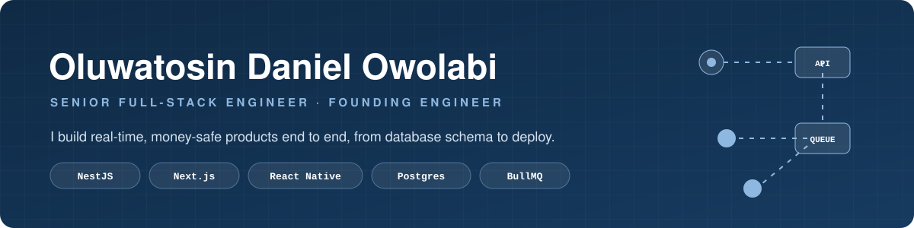
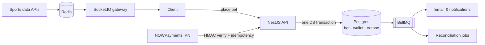

  

  
  
  
  

## Hi, I'm Daniel 👋

I'm a senior full-stack engineer and the **founding engineer at PhaseNet Innovations**, where I built **PlayZeet**, a live peer-to-peer sports betting platform that moves real money, from database schema and settlement logic to deployment.

I care about the parts of a product that have to be right: money math, payment webhooks, queues that don't lose jobs, and real-time data that stays in sync. I started as a UI/UX designer in 2019, so I also care how it looks when it gets there.

📍 Nigeria · open to remote, full-time roles worldwide

---

## ⚡ Featured: PlayZeet

Users bet against each other (peer-to-peer and group pari-mutuel pools) on live matches across **25+ sports**, with crypto and fiat deposits and withdrawals. Every bug touches someone's balance, so correctness drove the architecture:

| Decision | Why |
| --- | --- |
| **Decimal-safe money math** end to end | Floating-point rounding has no place in stake splits, fees, or refund-on-draw payouts |
| **Transactional outbox + BullMQ** for side effects | A failed email can never roll back a settled bet, and a rolled-back bet never sends a "you won" email |
| **Untrusted webhooks by default** | Every NOWPayments IPN is HMAC-SHA512 verified and idempotent; reconciliation jobs catch duplicates and missed events |
| **Redis cache + Socket.IO fan-out** | One upstream call per refresh serves every connected client, instead of each client polling the data provider |
| **Playwright E2E on all 30 bet-creation paths** | The flow where a silent regression costs the most gets the heaviest coverage |

**Stack:** NestJS · TypeScript · PostgreSQL · Prisma · Redis · BullMQ · Socket.IO · React · Vite · Tailwind · Docker · Hetzner / Render / Vercel

> PlayZeet's source is private. I'm happy to walk through the architecture on a call.

---

## 🛠️ Currently building

- **Tactix**: a browser-based football tactics board and animation studio for YouTube and social creators. *Next.js · react-konva · Remotion · BullMQ*
- **VitaScan**: a cross-platform mobile health monitoring app. *React Native · Expo · VisionCamera frame processors · expo-speech · EAS*
- **AI video generation SaaS**: queue-orchestrated generation over a pluggable Wan2.2 / Kling layer with FFmpeg assembly. *NestJS · BullMQ · Claude API*

---

## 🧰 Tech I use

   
   
   
  

**Also:** React Native / Expo, Ktor, Socket.IO, BullMQ, Playwright, Remotion, Claude API, NOWPayments, Flutterwave, Agora SDK

---

## 📂 Selected work

| Project | What it is |
| --- | --- |
| **PlayZeet** *(private)* | Live P2P sports betting platform, plus admin and agent dashboards, a headless CMS blog, and an agent/referral/campaign service |
| **Esdiac Provider** *(private)* | Kotlin/Ktor telecom-provider platform I built solo at Esdiac Global Systems |
| [**esdiac-analytic-app**](https://github.com/Owolabi-Oluwatosin/esdiac-analytic-app) | React frontend for a company-wide analytics dashboard |
| [**MovieLists**](https://github.com/Owolabi-Oluwatosin/MovieLists) | Movie catalogue with trailer previews and SEO |
| [**danielood.com**](https://danielood.com) | My portfolio: Next.js on Vercel with a Resend newsletter and JSON-LD structured data |

---

  Building something real-time, payment-heavy, or both? <a href="mailto:daniel.t.owolabi@gmail.com">Let's talk.</a>

